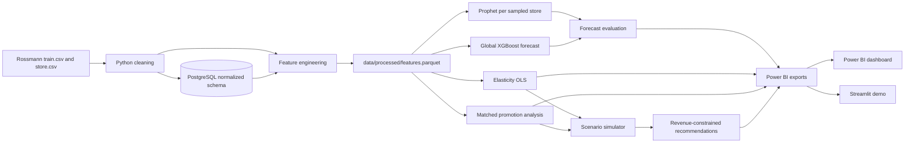

# Dynamic Pricing and Promotion Optimization Platform

An end-to-end retail analytics portfolio project built on the Rossmann Store
Sales dataset. The platform combines demand forecasting, descriptive price
elasticity, promotion-effect analysis, constrained pricing simulation, and
Power BI-ready reporting.

## Business problem

Retail teams need to balance several competing objectives:

- forecast store demand accurately enough to plan operations;
- understand where promotions produce incremental sales;
- identify segments that appear more or less price-sensitive;
- improve gross margin without causing an unacceptable revenue decline; and
- communicate recommendations through an accessible dashboard.

This project implements that workflow at daily store level. It compares
Prophet and XGBoost forecasts against a seasonal naive baseline, estimates
StoreType-level elasticity and promotion lift, then searches price/promotion
scenarios for the highest projected gross margin subject to a configurable
revenue floor.

## Tech stack

- Python 3.11
- pandas, NumPy, statsmodels, scikit-learn
- Prophet and XGBoost
- PostgreSQL, SQLAlchemy, psycopg2
- Jupyter, Matplotlib, Seaborn
- Power BI-ready CSV/Parquet exports
- Streamlit for the optional interactive demo

## Architecture



## Data source

The project uses the
[Rossmann Store Sales Kaggle competition](https://www.kaggle.com/c/rossmann-store-sales/data),
which contains historical daily sales and store attributes for 1,115 stores.
Download `train.csv` and `store.csv` from Kaggle and place them in
`data/raw/`. Raw source files are intentionally excluded from Git.

### Price-proxy limitation

Rossmann does not provide an observed product price or discount depth.
`avg_transaction_value = sales / customers` is therefore used as a smoothed
price-level proxy.

This proxy contains the target variable, so the resulting elasticity
coefficient is descriptive, not causal. It is useful for scenario exploration,
but it does not establish how demand would respond to an actual posted-price
experiment. Production decisions should be validated with randomized or
quasi-experimental pricing tests.

## Project structure

```text
.
|-- config/
|   `-- analysis_config.yaml
|-- data/
|   |-- raw/
|   `-- processed/
|       `-- powerbi_exports/
|-- notebooks/
|   `-- 01_eda.ipynb
|-- reports/
|   |-- figures/
|   |-- powerbi_dashboard_guide.md
|   `-- pricing_recommendations.md
|-- sql/
|   `-- schema.sql
|-- src/
|   |-- app.py
|   |-- config.py
|   |-- elasticity.py
|   |-- evaluate_forecasts.py
|   |-- export_for_powerbi.py
|   |-- features.py
|   |-- forecast_prophet.py
|   |-- forecast_xgboost.py
|   |-- load_data.py
|   |-- promo_impact.py
|   |-- recommend.py
|   `-- scenario_simulator.py
|-- .env.example
|-- LICENSE
`-- requirements.txt
```

## Setup

The pinned dependencies target Python 3.11.

```powershell
python -m venv .venv
.\.venv\Scripts\Activate.ps1
python -m pip install --upgrade pip
pip install -r requirements.txt
```

Copy `.env.example` to `.env` and enter PostgreSQL credentials:

```powershell
Copy-Item .env.example .env
```

Create the configured PostgreSQL database, then place:

```text
data/raw/train.csv
data/raw/store.csv
```

## Run the pipeline

Run commands from the repository root.

### 1. Create the schema and load source data

`load_data.py` executes `sql/schema.sql`, cleans the source files, removes
explicitly closed zero-sales rows, and loads the normalized tables.

```powershell
python src/load_data.py
```

### 2. Run EDA and create features

```powershell
jupyter nbconvert --to notebook --execute --inplace notebooks/01_eda.ipynb
```

Output:

- `data/processed/features.parquet`
- five EDA charts in `reports/figures/`

### 3. Train and evaluate demand forecasts

```powershell
python src/evaluate_forecasts.py
```

This uses the final 42 days as a time-based holdout and compares:

- seasonal naive lag-7;
- Prophet for a StoreType-stratified sample of stores; and
- a global XGBoost model using recursive holdout predictions to prevent future
  target leakage.

Outputs:

- `reports/forecast_comparison.csv`
- `reports/predictions/prophet_predictions.csv`
- `reports/predictions/xgboost_predictions.csv`
- actual-versus-predicted charts in `reports/figures/`

### 4. Estimate elasticity and promotion impact

```powershell
python src/elasticity.py
python src/promo_impact.py
```

Outputs:

- `reports/elasticity_by_segment.csv`
- `reports/promo_impact_by_segment.csv`
- `reports/elasticity_and_promo_findings.md`

### 5. Simulate scenarios and generate recommendations

Commercial assumptions are centralized in `src/config.py`, including gross
margin, current promotion depth, scenario ranges, and maximum allowed revenue
decline.

```powershell
python src/scenario_simulator.py
python src/recommend.py
```

Outputs:

- `data/processed/scenario_results.csv`
- `data/processed/recommendations.csv`
- `reports/pricing_recommendations.md`

### 6. Create Power BI exports

```powershell
python src/export_for_powerbi.py
```

Outputs are written to `data/processed/powerbi_exports/` in both CSV and
Parquet formats. See `reports/powerbi_dashboard_guide.md` for the exact pages,
measures, visuals, and filters.

### 7. Launch the optional Streamlit demo

```powershell
streamlit run src/app.py
```

The app reads the generated Power BI exports and lets users select a store,
compare forecast lines, select a StoreType, and inspect its pricing
recommendation.

For Streamlit Community Cloud, connect the GitHub repository, set
`src/app.py` as the entry point, and use Python 3.11. Commit the small generated
dashboard exports if the deployed app should display results without running
the pipeline in the cloud.

## Results

No model-result artifacts are currently present in this repository, so there
is no defensible MAPE-improvement or expected-margin-lift number to publish
yet. Placeholder claims are intentionally omitted.

After the pipeline is executed:

- the headline forecast improvement is the best non-naive value in
  `reports/forecast_comparison.csv`,
  column `mape_improvement_vs_naive_pct`;
- the segment margin lifts are stored in
  `data/processed/recommendations.csv`,
  column `expected_margin_lift_pct`; and
- the recommendation report reproduces those measured values in plain English.

This Results section should be updated only from those generated artifacts.

## Modeling safeguards

- All forecasting uses a chronological final-six-week holdout.
- XGBoost holdout lags and rolling statistics are updated recursively from
  prior predictions, not future actual sales.
- Current-day `customers` and transaction-value features are excluded from the
  demand model because they expose or derive from the target.
- Prophet and XGBoost are compared on common Store/date rows.
- Scenario recommendations must satisfy the configured revenue floor.
- Missing or nonnegative elasticity produces a review flag rather than an
  economically unsupported recommendation.

## Dashboard

The Power BI design contains three pages:

1. Demand Forecast
2. Promotion and Elasticity
3. Pricing Recommendations

Detailed field mappings and DAX measures are documented in
`reports/powerbi_dashboard_guide.md`.

## License

This project is licensed under the MIT License.

