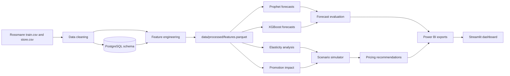

# Dynamic Pricing and Promotion Optimization Platform

## Live Demo

[Deployed Link](https://dynamic-pricing-promotion-optimization.streamlit.app)

## GitHub Repository

[GitHub Repository](https://github.com/Aakanshak/Dynamic-Pricing-Promotion-Optimization-Platform)

## Business Problem

Retail teams need to grow margin without damaging demand. This project answers four practical questions:

- Which stores and segments are likely to overperform or underperform demand forecasts?
- Which store types appear more sensitive to price-level changes?
- Where do promotions create measurable lift?
- Which pricing actions improve expected margin while respecting a revenue-risk floor?

The deployed Streamlit app is designed for recruiter review. It can run from committed dashboard exports when available, and it falls back to a small built-in demo dataset when raw Kaggle data, PostgreSQL, `.env`, models, or generated pipeline outputs are unavailable.

## Architecture And Pipeline



The full analytics pipeline remains available for local execution. The Streamlit app does not require pipeline execution during startup.

## Tech Stack

- Python 3.11
- Streamlit and pandas for the deployed dashboard
- PostgreSQL, SQLAlchemy, and psycopg2 for local data loading
- scikit-learn, Prophet, XGBoost, and statsmodels for modeling and analysis
- Jupyter, Matplotlib, and Seaborn for EDA
- Power BI-ready CSV exports for reporting

## Repository Structure

```text
.
|-- .streamlit/
|   `-- config.toml
|-- config/
|   `-- analysis_config.yaml
|-- data/
|   |-- raw/
|   `-- processed/
|       `-- powerbi_exports/
|-- notebooks/
|   `-- 01_eda.ipynb
|-- reports/
|   |-- powerbi_dashboard_guide.md
|   `-- pricing_recommendations.md
|-- sql/
|   `-- schema.sql
|-- src/
|   |-- app.py
|   |-- load_data.py
|   |-- features.py
|   |-- evaluate_forecasts.py
|   |-- forecast_prophet.py
|   |-- forecast_xgboost.py
|   |-- elasticity.py
|   |-- promo_impact.py
|   |-- scenario_simulator.py
|   |-- recommend.py
|   `-- export_for_powerbi.py
|-- requirements.txt
`-- requirements-dev.txt
```

## Local Setup

Use the lightweight app environment when you only want to run the dashboard:

```powershell
python -m venv .venv
.\.venv\Scripts\Activate.ps1
python -m pip install --upgrade pip
pip install -r requirements.txt
streamlit run src/app.py
```

Use the full development environment when running the analytics pipeline:

```powershell
python -m venv .venv
.\.venv\Scripts\Activate.ps1
python -m pip install --upgrade pip
pip install -r requirements-dev.txt
```

Copy `.env.example` to `.env`, add PostgreSQL credentials, then download the Kaggle Rossmann files and place them here:

```text
data/raw/train.csv
data/raw/store.csv
```

Raw Kaggle CSVs are intentionally ignored and should not be committed.

## Pipeline Commands

Run commands from the repository root.

```powershell
python src/load_data.py
jupyter nbconvert --to notebook --execute --inplace notebooks/01_eda.ipynb
python src/evaluate_forecasts.py
python src/elasticity.py
python src/promo_impact.py
python src/scenario_simulator.py
python src/recommend.py
python src/export_for_powerbi.py
```

Important outputs:

- `data/processed/features.parquet`
- `reports/forecast_comparison.csv`
- `reports/predictions/`
- `data/processed/recommendations.csv`
- `data/processed/powerbi_exports/`
- `reports/elasticity_and_promo_findings.md`
- `reports/pricing_recommendations.md`

## Streamlit Deployment

Deploy on Streamlit Community Cloud with these settings:

- Repository: `https://github.com/Aakanshak/YOUR-REPO-NAME`
- Branch: `main`
- Main file path: `src/app.py`

The root `requirements.txt` is intentionally minimal for deployment:

```text
streamlit
pandas
```

No Streamlit secrets are required for the demo dashboard. The app does not connect to PostgreSQL, read `.env`, or require `data/raw/train.csv` or `data/raw/store.csv` at startup.

If `data/processed/powerbi_exports/sales_actuals_vs_forecast.csv` and `data/processed/powerbi_exports/pricing_recommendations.csv` are present, the app uses them. If they are missing, the app automatically shows a built-in demo dashboard so the deployed page remains usable.

## Modeling Safeguards

- Forecasting uses a chronological holdout window.
- XGBoost lag and rolling features are designed to avoid future target leakage.
- Elasticity is descriptive because Rossmann does not include observed price or discount-depth fields.
- Scenario recommendations are constrained by a configurable revenue floor.
- Missing or economically invalid elasticity estimates are flagged for review rather than forced into a recommendation.

## Version-Control Hygiene

The repository is configured to ignore local secrets, virtual environments, Python caches, raw Kaggle files, model binaries, and large generated outputs. Do not commit:

- `.env`
- `.venv/` or `venv/`
- `__pycache__/` or `*.pyc`
- `data/raw/*.csv`
- `models/`
- `*.joblib` or `*.pkl`
- `reports/predictions/`
- `.ipynb_checkpoints/`
- `.vscode/`

## License

This project is licensed under the MIT License.
